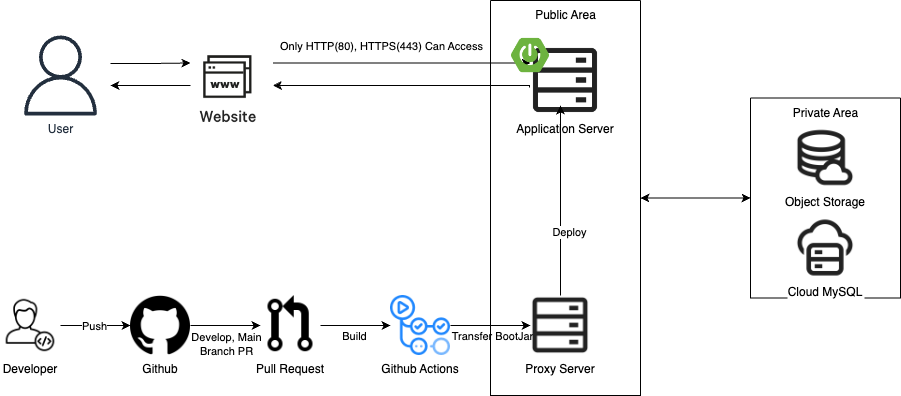
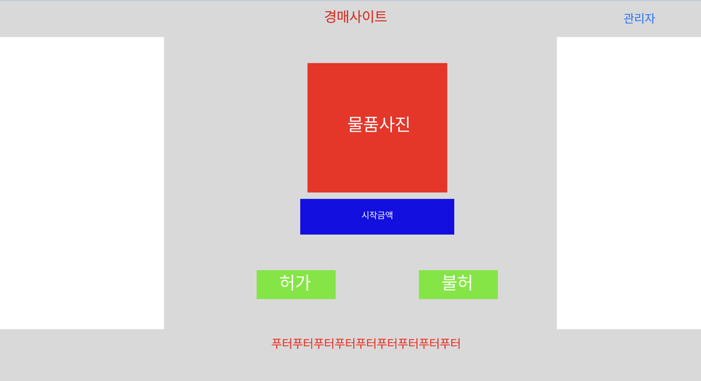
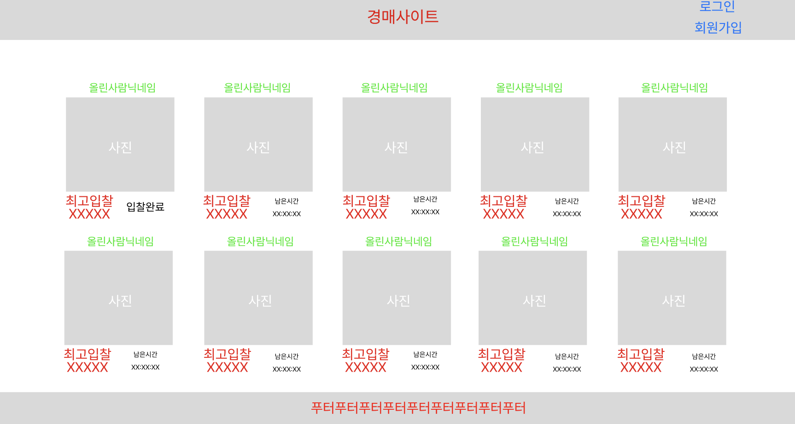
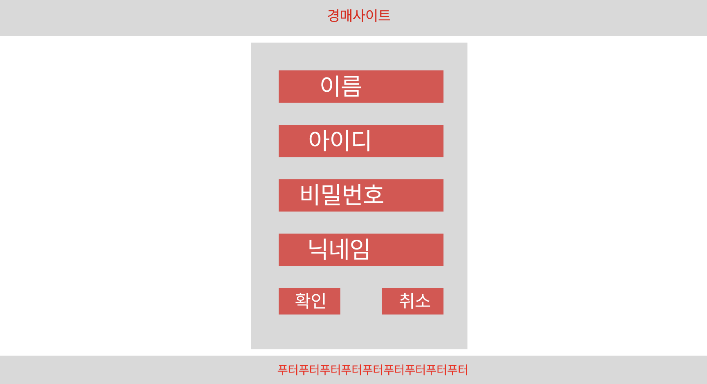
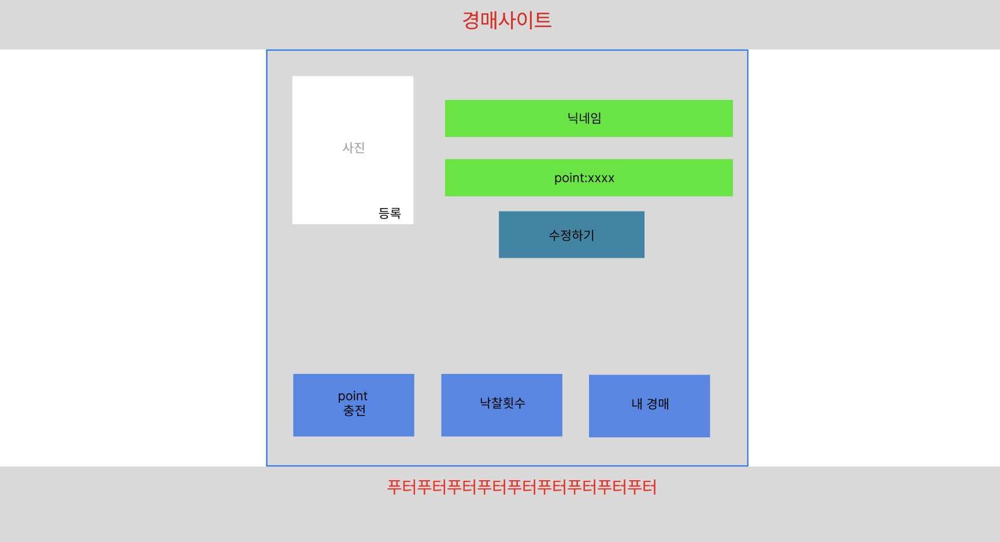
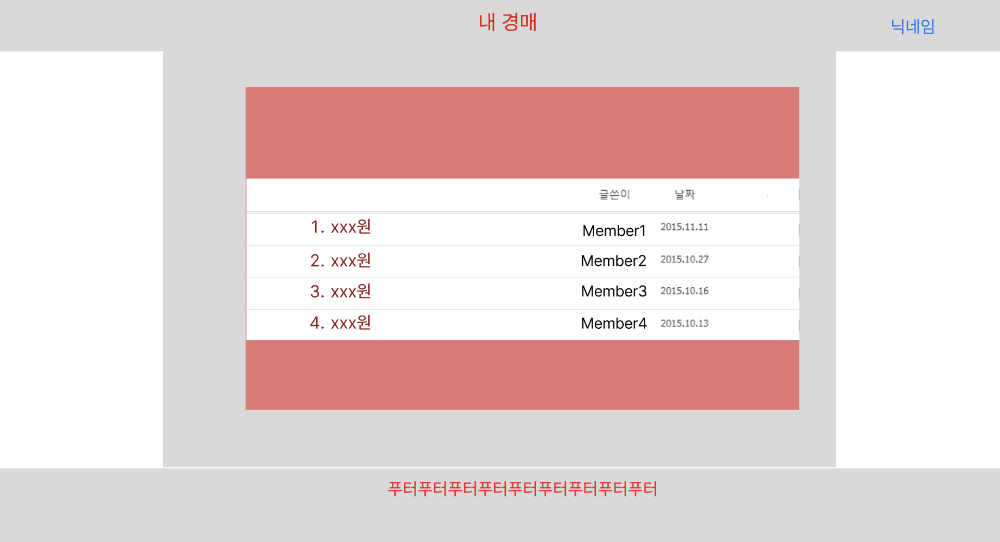
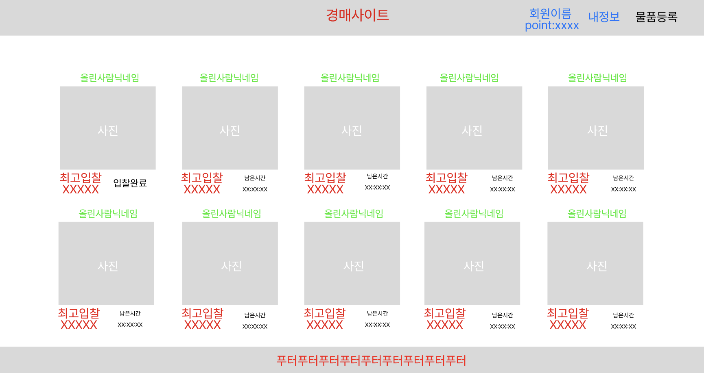
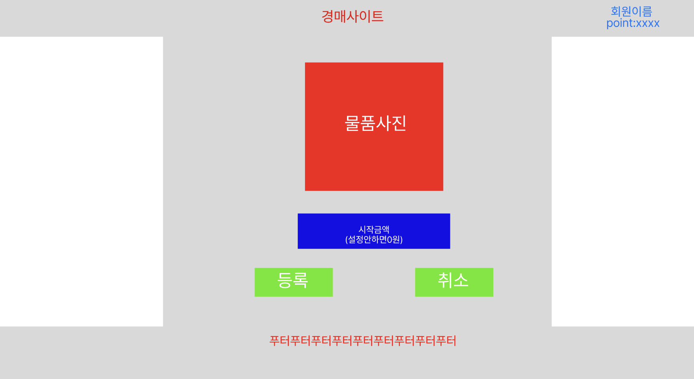
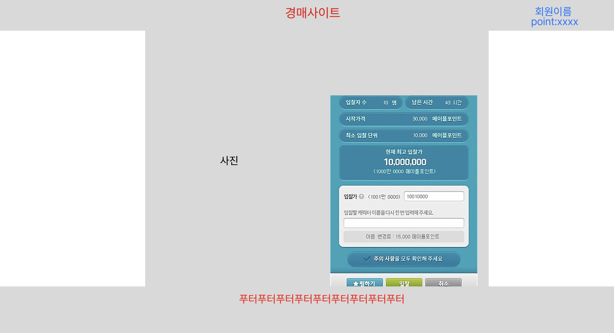
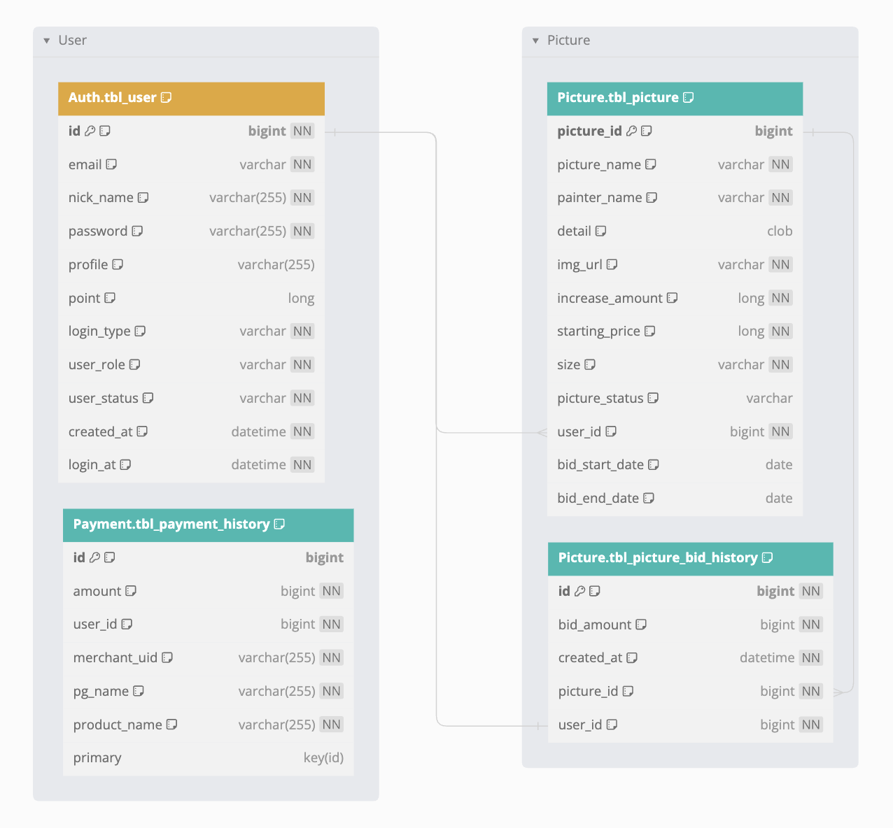

# Picasso 
- 
- [홈페이지 링크](http://picasso.jong1.com/) 

---
## 주제
> [!NOTE]  
> 미술품 경매 사이트
---
## Git
### 브랜치 전략
- `Git Flow`

### Commit Convention
|TagName|Description|
|:---:|:---|
| feat | 기능 개발 및 추가 |
| fix | 버그 수정 |
| docs | 문서 수정 |
| style | 기능변경 없이 코드 스타일만 병경하는 경우 | 
| test | Test코드 작성 |
|chore | 빌드관련작업 전부 |
| rename | 파일명 수정 |

### Title
- 큰 테마로 간단하게만 적도록 합니다.
- `Issue`가 존재하는 경우에는 `Issue Number`를 같이 링크하도록 합니다.

### Body
-  `Title`에서 작성한 테마 기능, 또는 작업 내역에 대하여 `무슨 작업`을 `왜?`에 초점을 두어 작성한다.
---

## TechStack
### FrontEnd

### BackEnd

### Database

### Tool

---
## Architecture
 

---
## ProtoType Wire Frame
> 초안으로 제작한 WireFrame 다들..그저 BackEnd였다...

---
## ERD
> [!NOTE]
> DBDocs의 문서화 내용 변경하고싶은 경우   
> `./Docs/Picasso.dbml`의 파일 내용을 변경한 다음 `dev`브랜치에 Push가 진행될 경우 자동 갱신됩니다.

- [DBDocs 링크](https://dbdocs.io/donsonioc2010/Picasso)

### ERD Image

---
## 구현 기능

---
## CI/CD

